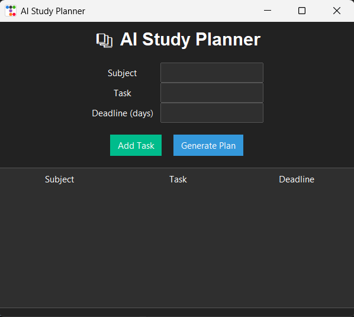

# 📚 AI Study Planner

A smart CLI-based study planner built with Python.

## 🎨 Modern GUI


## 🚀 Features
- Add tasks with deadlines
- View all tasks
- AI-based priority planning
- Data saved in JSON

## 🛠 Tech Used
- Python
- JSON
- OOP

## ▶️ Run
```bash
python main.py
